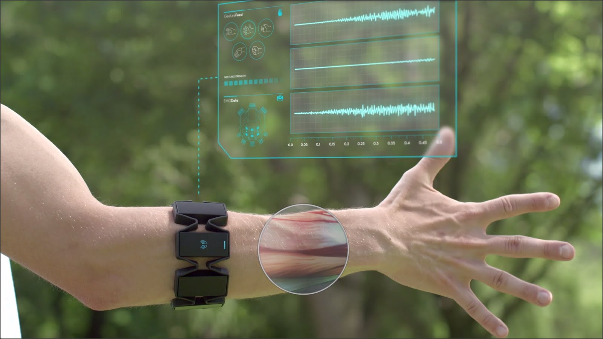
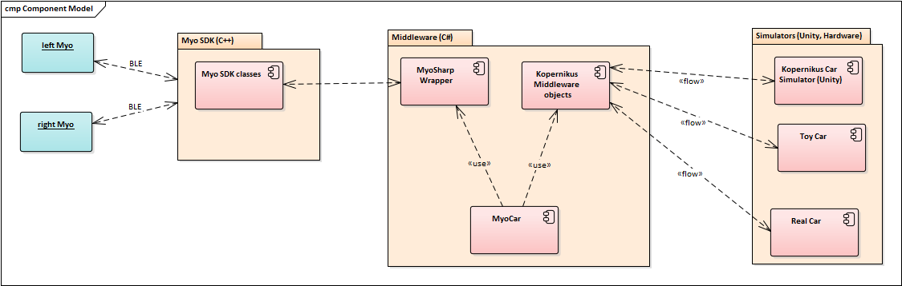

# Myo Car - a new way to remote control a car

##  Rationale
during HackZurich 2017 we tried to implement a new way to remote control a car as part of the challenge set up by AMAG and Kopernikus Automotive. During this challenge our team wanted to implement a car remote control using 2 Myo armbands by Thalmic Labs (http://www.myo.com). These armbands measure the tonus of the forearm muscles and offer a wide variety of gesture controls. We used these to control the various functionalities provided by the Kopernikus Middleware API for real or simulated cars.

## How it works...the functional way

The car (be it as Unity simulator or toy car provided by Kopernikus) will be controller via 2 Myo armbands.

### defining direction
The left armband controls the steering wheel angle by rotating the forearm into the desired direction. Through this movement the steering axis of the car is moved and given some throttle, the car moves in that direction.

### defining the speed
The right armband controls the throttle of the car.  Resting the right forearm in a 90° angle referrs to standing still. lifting the forearm over this rest-position accelerates the car, lowering it will either decrease speed, or, when going under the rest-position actively uses the breaks to stop the car fast.

### gears
as any real car, the models use a simple automatic drive with 3 gear positions.

* neutral
* back (backward)
* drive (forward)

through a simple wave-in gesture  (bending) your hand towards the other arm) the gears will be shifted from forward to neutral to backward; by waving out gestures (bending your hand away from the other arm) the gearshift goes from backward to neutral to forward.
with this easy movement it is intuitively possible to control the direction of the car effectively.

### turn signal
as turn signals are an important behaviour in daily street traffic, we also implemented gestures to set and turn off the left, resp. right turn signal.
by clanging one's right hand to a fist, the right turn signal is toggled from off to right and back; by doing this with one's left fist, the left turn signal is turned on or off.. please note that only one side can be active, so turning a signal left or right will disable the other direction if set.

## how it works...the technical way

as shown in the figure above, the Myos communicate with the SDK classes via Bluetooth Low Energy. The SDK then wraps these information into C++ objects, which we consume via MyoSharp-Wrapper layer in C# and react in the MyoCar application to these (orientation events, poses, connections etc). From there we instantiate the Kopernikus middleware and depending on the attached vehicle-type (simulator, real or toy car) we communicate with it to remote control the car instance. Additional Log information in the MyoCar application provide helpful information about the actual events, the state of the application and connections, the connected devices etc.

